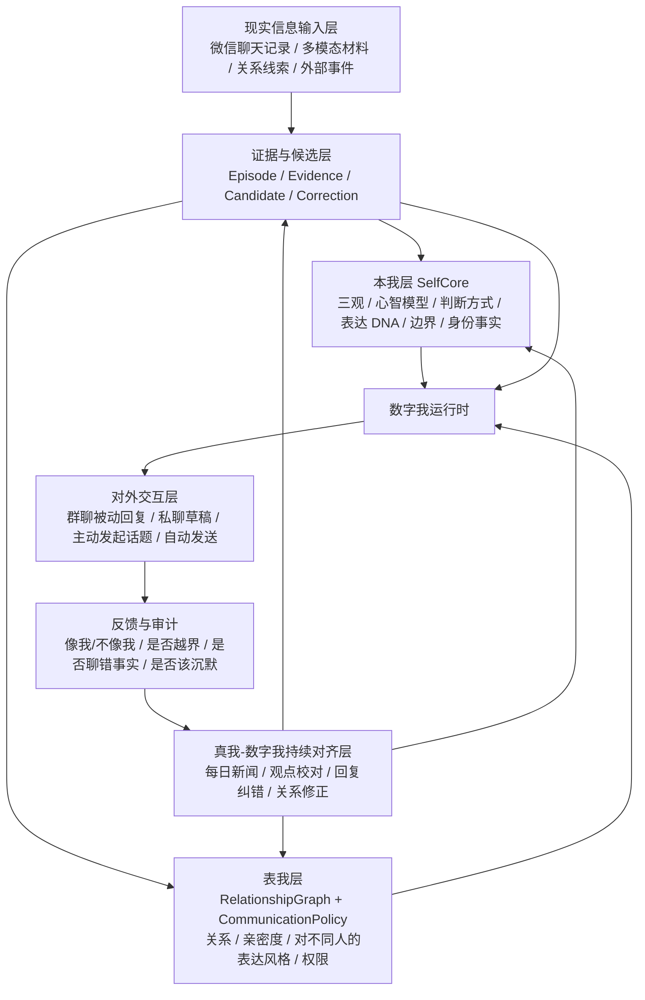

# 数字我项目架构

## 目标定义

本项目不是聊天记录分析工具，也不是微信自动回复工具。

项目核心是一个以“我”为中心、可初始化、可校对、可进化、可对外行动的数字我。它要逐步具备：

- 和真我一致的三观、判断方式、价值排序和边界感
- 对不同关系中的“我”的不同外显形态的理解
- 从现实信息中持续学习和修正自己的能力
- 和真我进行观点、新闻、关系、表达方式的持续对齐
- 在受控权限下参与现实生活中的主动和被动沟通

数字我不是静态 prompt，也不是单次模型生成结果。它是由本我、表我、现实输入、真我对齐和对外交互共同组成的持续系统。

## 核心原则

1. 项目中心永远是“我”，不是联系人、消息、工具或界面。
2. `SelfCore` 是数字我的核心慢变量，承载三观、判断方式、表达 DNA、边界和身份事实。
3. `RelationshipGraph` 和 `CommunicationPolicy` 承载表我：不同人眼里的我不同，因为亲密度、共同经历、表达原则、话题边界和互动风格都不同。
4. 微信聊天记录、多模态材料、每日新闻、外部事件和用户反馈都只是现实输入，不能未经审计直接改写人格。
5. 真我对数字我的校对是最高优先级信号，必须能反馈到 `SelfCore`、`RelationshipGraph` 和 `CommunicationPolicy`。
6. 对外交互是数字我进入现实生活的执行层，默认草稿和待审，自动发送只能在已授权、低风险、事实审计通过的场景中发生。
7. 自进化必须可追溯、可回滚、可测试，不能因为短期聊天或单次情绪漂移本我。

## 总体架构



## 五层架构

### 1. 本我层：SelfCore

本我是真正的数字我核心，主文件存放在 `runtime/self-core/SelfCore.v0.1.md`。其中身份事实作为 SelfCore 的结构化子模块，存放在 `runtime/self-core/identity-facts/`。

它回答的是：

- 我如何理解世界、人性、社会、组织、技术和历史
- 我认为什么重要，什么不可让渡，什么只是短期噪声
- 我如何做判断、拆问题、识别激励、看风险和机会
- 我如何表达：短句、反问、吐槽、判断、追问、边界感
- 我有哪些反模式：过度判断、焦虑、控制欲、情绪化或误判
- 我有哪些稳定身份事实：我会什么、不会什么、真实偏好、生活约束、角色身份、禁止自称或禁止承诺的内容。

身份事实属于本我，不属于普通多模态记忆或关系画像。聊天记录、多模态材料和持续交互可以提供身份事实候选，但只有经过用户确认、强证据重复或明确校对后，才能进入 `runtime/self-core/identity-facts/facts.jsonl`。运行时生成必须先读取相关身份事实；如果草稿与高置信身份事实冲突，必须改写、降级或阻止输出。

`SelfCore` 是慢变量。它可以被聊天记录、多模态材料、新闻对齐和用户校对更新，但必须经过候选、合并、确认、备份和注入日志。

本我不直接等于外显说话风格。稳定的三观会贯穿所有关系，但不同人看到的我并不一样。

### 2. 表我层：RelationshipGraph + CommunicationPolicy

表我是别人眼里的我。它不是虚假人格，而是本我在不同关系、不同亲密度、不同场景下的外显形态。

它由两部分组成：

- `RelationshipGraph`：谁是谁、我和 TA 是什么关系、亲密度/样本量、称呼、共同场景、共同话题、权限边界。
- `CommunicationPolicy`：我面对 TA 或某个群时怎么说、什么时候说、说到什么程度、什么内容要避开、什么风险必须回到真我确认。

这里必须强调：

- 同一个“我”，在不同人眼里是不一样的。
- 和家人、长期工作伙伴、朋友、同学、服务关系、陌生群友的表达原则不同。
- 亲密度越高、历史样本越多，数字我越能学习到具体互动方式。
- 亲密度低或身份未映射时，系统只能使用低置信度、低亲密度表达，不能假装熟悉。
- 关系大类只是弱先验，不能生成“家人模板”“同事模板”“朋友模板”。
- 真正优先的是 `DyadicProfile(person_id)`：我和这个人一一对应的具体话题、句长、玩笑强度、主动频率、追问方式、边界和时段。

表我的生成优先级：

```text
当前对话上下文
  > 对应人的 DyadicProfile
  > 当前群/私聊 SceneProfile
  > RelationshipGraph 的身份、亲密度、权限
  > CommunicationPolicy 的风险和表达原则
  > SelfCore 的稳定三观与表达 DNA
```

### 3. 现实信息输入层

现实信息输入层负责把世界中的材料变成可审计证据，而不是直接变成人格。

输入包括：

- 微信聊天记录：初始化三观、社会关系、表达习惯、亲密度、共同话题、群聊场景。
- 多模态材料：截图、视频、录屏、音频、ASR、说话人分离，用于补充我关注什么、如何反应、如何表达、哪些场景有代表性。
- 用户显式补充：真实关系、称呼纠错、关系边界、某条回复为什么不像我。
- 外部事件：新闻、行业事件、节假日、现实事项。

输出不是直接改写 `SelfCore`，而是：

- `Episode`：可追溯片段
- `Evidence`：支持某个判断的证据
- `Candidate`：可能进入 SelfCore / RelationshipGraph / CommunicationPolicy 的候选更新
- `Correction`：真我的明确纠错
- `SourceRef`：原始文件、消息 ID、时间和会话对象

证据权重：

- 强证据：我自己说过、真我明确确认、长期稳定重复、明确称呼和关系。
- 中证据：上下文推断、多次共同话题、群聊定向互动。
- 弱证据：单次提及、模糊昵称、主题相似。
- 禁用证据：转发长文、复制内容、明显 AI 文本、他人观点、无法确认来源的 OCR 噪声。

### 4. 真我-数字我持续对齐层

真我不是训练数据之一，真我是数字我的最高校对者。

这一层负责让数字我在具体事件中持续贴近真我：

- 每日新闻：用具体事件检验“我会怎么看”，细化三观和判断方式。
- 回复校对：哪些回复像我，哪些不像我，哪里太机械、太冷、太热、太确定、太不懂上下文。
- 关系校对：某人是谁、亲密度如何、称呼是否真实、主动沟通边界在哪里。
- 事实纠错：模型聊错事实、用旧知识、凭空补具体人名或事件时，必须记录为反例。
- 风险校对：哪些场景可以自动，哪些必须回到真我确认。

每日新闻对齐不是新闻摘要功能，而是三观校准功能。

它的输出应该进入候选池：

- `SelfCoreCandidate`：新的稳定判断、价值排序、反模式或边界。
- `RelationshipGraphCandidate`：某人关系、称呼、共同话题、亲密度修正。
- `CommunicationPolicyCandidate`：某类场景下该说/不该说、自动/不自动、风险等级修正。

慢变量进入 `SelfCore` 前必须经过真我确认；快变量可以先进入候选或短期记忆，但要可回滚。

### 5. 对外交互层

对外交互层是数字我逐步代替真我参与现实生活的执行层。

它包括：

- 群聊被动响应：监听已授权群，理解上下文，判断是否需要接话。
- 私聊/联系人回复草稿：根据关系、亲密度、共同话题和当前上下文生成候选回复。
- 主动发起话题：根据新闻、关系维护、共同兴趣、近期状态生成主动开场。
- 辅助发送：真我确认后发送。
- 有限自动发送：仅低风险、已授权、事实审计通过、上下文充分的场景。

这一层必须保持两个反馈回路：

1. 对外行为反馈到真我校对：这句话像不像我、该不该说、有没有越界。
2. 真我校对再反馈到本我和表我：必要时更新 `SelfCore`、`RelationshipGraph` 和 `CommunicationPolicy`。

群聊上下文采用双层结构：

- 宽上下文：最近连续 40 条、最长 1 小时，用于理解主题、人物立场、指代和梗。
- 接话窗口：最后 1-3 条，只能直接回复这里，不能回到旧话题。

自动发送硬门：

- 事实审计失败，不发送。
- `R2_medium`、`R3_high`、`R4_forbidden` 不发送。
- 涉及买卖/仓位/金额/承诺/隐私/法律医疗/冲突升级，不自动发送。
- 已授权群里，群友身份未映射不等于内容高风险；普通日常短回复可以是 `R1_low`，但不能假装熟悉。

## 数据对象边界

| 层 | 核心对象 | 主要落点 |
| --- | --- | --- |
| 本我 | `SelfCore`, `IdentityFact`, `SelfCoreCandidate`, `InjectionLog` | `runtime/self-core/`, `runtime/self-core/identity-facts/` |
| 表我 | `Person`, `Relationship`, `Alias`, `DyadicProfile`, `PermissionProfile` | `runtime/relationship-graph/`, `runtime/dyadic-profiles/`, `runtime/communication-policy/` |
| 现实输入 | `Episode`, `Evidence`, `SourceRef`, `MultimodalCandidate` | `data/generated/`, `runtime/multimodal-memory/` |
| 真我对齐 | `Correction`, `PreferenceSignal`, `NewsAlignment`, `UpdateProposal` | `data/generated/news-alignment/`, `data/generated/selfcore-candidate-merges/` |
| 对外交互 | `GroupEvent`, `ReviewItem`, `Draft`, `SendDecision`, `AuditResult` | `data/generated/wechat-bridge/` |

## 训练与蒸馏路线

### 阶段 1：现实证据整理

目标是把聊天记录和多模态材料整理为可追溯证据：

- 清洗微信聊天记录
- 标记我说的话、别人说的话、引用、转发、群聊上下文
- 抽取 episode、关系证据、称呼证据、话题证据
- 多模态材料抽帧、ASR、说话人分离和人工备注

### 阶段 2：本我和表我初始化

输出：

- `SelfCore v0.1`
- `RelationshipGraph v0.1`
- `DyadicProfile v0.1`
- `CommunicationPolicy v0.1`
- 初版评估集

原则：

- 结构化蒸馏优先于模型微调。
- 原始聊天记录不进入 Git。
- 关系和表达必须保留证据等级、置信度和数据缺口。

### 阶段 3：运行时数字我

运行时根据当前任务组合：

- `SelfCore`：稳定三观和表达 DNA
- `RelationshipGraph`：身份、关系、亲密度、权限
- `DyadicProfile`：对这个人的具体表现型
- 当前上下文：最后消息、宽上下文、事实证据
- `CommunicationPolicy`：风险、主动/被动、是否发送

### 阶段 4：真我校对与自进化

所有外部互动、新闻对齐、多模态摄入和纠错都会进入候选池。

更新流程：

1. 收集证据和反馈。
2. 生成候选更新。
3. 分类为本我、表我或策略更新。
4. 慢变量必须真我确认。
5. 合并、备份、注入。
6. 跑评估和回归案例。
7. 记录版本和变更原因。

## 当前运行界面

- 主关系/群监控/模拟交互：`http://127.0.0.1:8788/`
- 多模态摄入：`http://127.0.0.1:8788/multimodal.html`
- 每日新闻对齐：`http://127.0.0.1:8788/news-alignment.html`
- SelfCore 候选工作台：`http://127.0.0.1:8788/selfcore-candidates.html`
- PC 微信伴随服务 API：`http://127.0.0.1:8790/`

## 评估体系

必须持续评估：

- 本我一致性：三观、判断方式和边界是否稳定。
- 表我一致性：面对不同人是否呈现不同但合理的我。
- 关系理解：是否知道对方是谁、亲密度如何、常聊什么、不能说什么。
- 上下文理解：是否理解当前群聊主题，不远距离接话，不问“你们在聊什么”。
- 事实审计：是否避免用旧知识补当前事实。
- 风险控制：是否只在 `R1_low` 等低风险授权场景自动发送。
- 自进化质量：候选更新是否有证据、是否经过真我确认、是否可回滚。

## MVP 路线

### MVP 1：本我初始化

- 完成 `SelfCore v0.1`
- 建立本我评估集
- 支持每日新闻对齐产生 SelfCore 候选

### MVP 2：表我初始化

- 完成 `RelationshipGraph v0.1`
- 完成 `DyadicProfile` 蒸馏
- 明确每个关系的亲密度、表达风格、权限和风险边界

### MVP 3：现实输入管线

- 微信聊天记录导入和 episode 抽取
- 多模态摄入、ASR、说话人分离
- 候选池、证据链和注入流程

### MVP 4：真我持续对齐

- 每日新闻对齐
- 回复纠错和不像我反馈
- 候选合并、确认和注入

### MVP 5：受控对外交互

- 群聊被动响应
- 主动发起话题
- 事实审计和风险门控
- 低风险自动发送和硬停止开关
