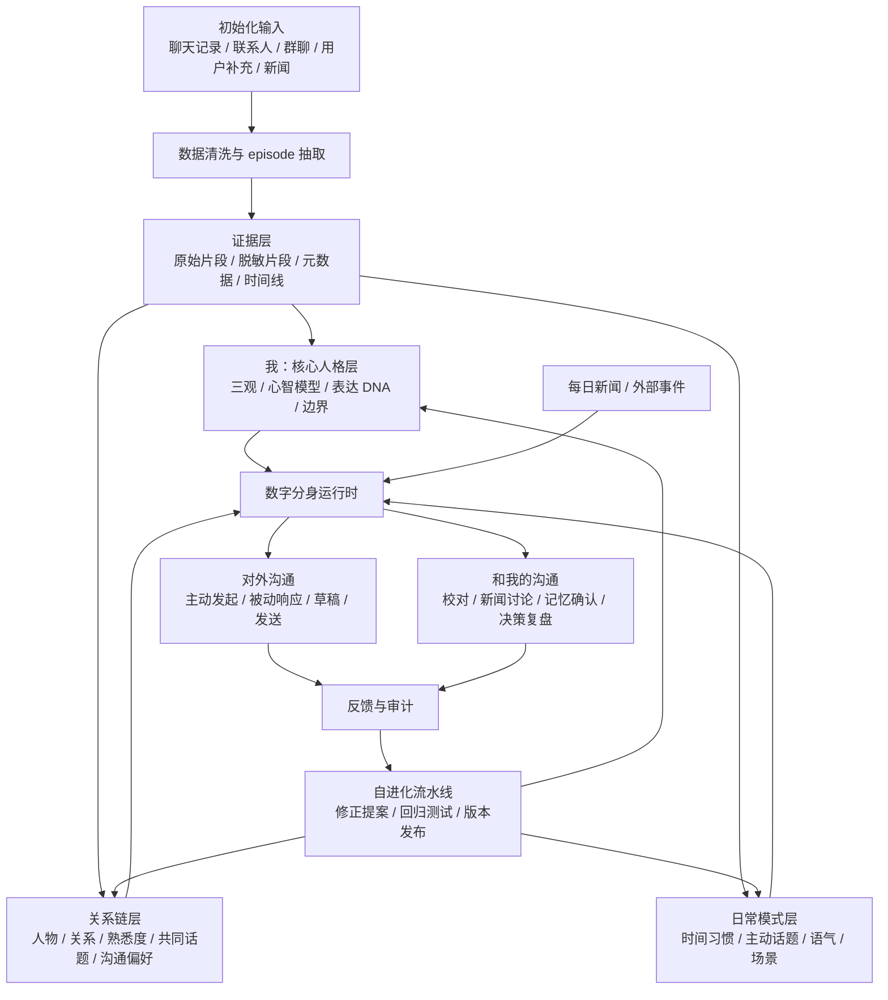

# 数字分身项目架构

## 目标定义

本项目的目标不是做一个聊天记录分析工具，而是初始化并持续进化一个以“我”为核心的数字分身。

这个数字分身需要：

- 拥有和我一致的三观、判断方式、表达方式和沟通习惯
- 理解我的社会关系链，以及我和不同人日常爱聊什么
- 能主动发起和不同人的沟通
- 能响应别人和我的沟通
- 能每天和我校对、讨论新闻、吸收修正
- 不是静态 bot，而是一个被初始化后可以自进化的独立个体

## 核心原则

1. 项目核心是“我”，不是联系人、聊天记录或工具界面。
2. 数字分身的判断必须能追溯到证据、规则或用户校对。
3. “三观与判断方式”是慢变量，“日常话题和近期状态”是快变量。
4. 关系链不是通讯录，而是带关系类型、熟悉度、共同话题、边界和历史上下文的社会图谱。
5. 默认先生成草稿和建议，不直接替我发送消息；自动发送必须有联系人级权限和风险分级。
6. 自进化必须可审计、可回滚、可测试，不能因为几条新聊天就漂移人格。

## 总体架构



## 系统分层

### 1. 输入层

初始化输入包括：

- 微信聊天记录：私聊、群聊、自我发言、上下文、时间、引用、转发
- 联系人与群信息：昵称、备注、群成员、历史称呼、身份线索
- 已有派生结果：episode、关系图谱、主动话题报告、蒸馏语料分层
- 用户显式补充：真实关系、重要事件、偏好、禁区、纠错
- 外部信息：每日新闻、行业事件、节假日、日历和提醒

输入层要区分四种权重：

- 强证据：我自己说过、明确称呼、明确关系、反复稳定行为
- 中证据：上下文推断、多次共同话题、群聊互动模式
- 弱证据：单次提及、相邻消息、模糊昵称、主题相似
- 禁用证据：转发长文、复制内容、明显 AI 文本、他人观点

### 2. 证据层

证据层保存可追溯材料，不直接等同于人格。

核心对象：

- `Episode`：一个有上下文的聊天片段或事件
- `Evidence`：支持某个判断的来源、置信度和时间
- `Correction`：用户显式修正
- `SourceRef`：原始文件、消息 ID、时间、会话对象

证据层职责：

- 清洗编码、去重、切分 episode
- 标记我说的话、别人说的话、转发内容、引用内容
- 给每条推断保留证据路径
- 为隐私和权限控制提供依据

### 3. “我”的核心人格层

这是系统的中心。

核心对象可以叫 `SelfCore`，包含：

- 世界观：我如何理解世界、社会、组织、人性、技术和历史
- 人生观：我如何理解目标、成长、命运、意义、虚无和长期主义
- 价值观：我认为什么重要，什么不可让渡，什么值得或不值得
- 心智模型：我常用的拆解方式、类比、判断框架
- 决策启发式：我如何在 ROI、长期价值、风险、关系、现实约束之间取舍
- 表达 DNA：短句节奏、追问方式、吐槽、否定、鼓励、边界感
- 反模式：我容易过度判断、情绪化、过度控制或误判的场景

重要设计：

- `SelfCore` 是慢变量，不能被单次聊天快速改写。
- 更新必须经过用户校对或高置信度长期证据。
- 每次更新都要生成变更说明和回归测试结果。

### 4. 关系链层

关系链不是简单联系人列表，而是 `RelationshipGraph`。

`RelationshipGraph` 只负责身份、客观关系、称呼、共同场景和权限入口。过去放在人物节点里的通用 `communication_profile` 拆出，迁移到独立的 `DyadicProfile` 层，避免把关系类型误当成具体说话方式。

### 5. 双人沟通表现型层

数字分身面对不同的人不是同一个表面人格。稳定的“我”会保留，但话题选择、句子长度、玩笑强度、直接程度、主动频率、回复速度和时间窗口会随对象变化。

新增 `DyadicProfile(person_id)`：

- 我与 TA 真正常聊的话题，以及双方分别更常发起哪些话题
- 私聊和群聊定向互动的样本覆盖
- 我对 TA 的平均句长、短句比例、连续发送节奏、追问比例
- 判断、边界、行动、玩笑、不确定性等表达机制占比
- 谁更常主动、平均回复时延、常见活跃时间
- 在不同群场景中的表现差异
- 画像置信度、数据缺口和最后更新时间

生成时的上下文优先级：

```text
当前消息与最近上下文
  > 对应联系人的 DyadicProfile
  > 当前私聊/群聊 SceneProfile
  > SelfCore
  > 通用关系类型规则
```

关系大类只能作为缺数据时的弱先验，不能直接生成“家人模板”“同事模板”。如果双人定向样本不足，系统必须明确标为低置信度。

核心对象：

- `Person`：一个真实人物或暂未合并的身份节点
- `Relationship`：我和 TA 的客观关系
- `Alias`：昵称、备注、群名、称呼
- `TopicProfile`：我们常聊的话题
- `CommunicationProfile`：沟通频率、语气、主动性、边界
- `PermissionProfile`：是否允许自动草稿、是否允许自动发送、禁区

关系分类优先级：

1. 核心家庭
2. 亲属 / 姻亲
3. 同事 / 前同事
4. 同学 / 校友
5. 服务 / 实务协作
6. 朋友
7. 间接提及人物
8. 其他

关系链层要支持：

- 主动沟通对象选择
- 被动消息响应上下文
- 关系温度和近期状态判断
- 共同话题检索
- 禁区和敏感关系保护

### 5. 日常沟通模式层

这一层描述“我通常怎么说话、什么时候说、对谁说”。

核心对象：

- `SpeakingHabit`：时间段、工作日/周末、白天/晚上差异
- `TopicTrigger`：某类新闻、兴趣、生活事件会触发什么话题
- `ToneProfile`：不同关系下的语气、密度、玩笑比例、直接程度
- `InitiationPattern`：我主动开口的常见方式
- `ResponsePattern`：我回复别人时的节奏、长度、态度

这层是快变量，可以随新聊天和每日校对逐步更新。

## 训练与蒸馏路线

### 阶段 1：清洗与分层

目标是得到可审计语料，而不是直接训练。

输出：

- `core-episodes`：三观、判断、目标感、价值观
- `style-episodes`：表达方式、语气、句式、互动节奏
- `counterexample-episodes`：反例、修正、犹豫、误判
- `background-episodes`：背景信息、经历、关系上下文
- `relationship-evidence`：关系链和称呼证据
- `topic-evidence`：我和不同人的共同话题

### 阶段 2：蒸馏

优先做“蒸馏成结构化人格和规则”，暂不优先微调模型。

原因：

- 聊天记录高度隐私，不适合一开始就进入不可解释训练。
- 结构化蒸馏更容易审计和修正。
- 关系和边界需要精确控制，不能只靠模型记忆。

输出：

- `SelfCore v0.1`
- `RelationshipGraph v0.1`
- `CommunicationPolicy v0.1`
- `ExpressionDNA v0.1`
- `EvaluationSet v0.1`

### 阶段 3：运行时增强

运行时主要用：

- 检索增强：从关系链、episode、近期事件中取上下文
- skill / system prompt：加载 `SelfCore` 和表达规则
- 工具调用：查询关系、共同话题、历史上下文、新闻
- 风险门控：判断是否只生成草稿、是否需要我确认

### 阶段 4：可选训练

只有当结构化系统稳定后，再考虑训练：

- 小模型分类器：关系类型、风险等级、话题触发、消息意图
- 表达风格模型：只使用脱敏、已审计、自我发言样本
- 偏好模型：根据我的校对记录学习“更像我”的选择

不要一开始就把全量聊天记录丢给大模型微调。

## 运行时交互

### PC 微信伴随层

个人微信不作为数字分身核心的一部分，而是一个可替换的本地通道适配器 `WeChatBridge`。它只在已登录的 Windows PC 上运行，不保存账号密码，不注入微信进程，不读取登录凭证。

```text
PC 微信窗口
  -> WeChatAdapter（只读采集）
  -> GroupEvent / 去重 / 发言人识别
  -> GroupContext（每个群独立的多轮上下文）
  -> TriggerEngine（@我、直接提问、白名单话题）
  -> RelationshipGraph + DyadicProfile + SelfCore
  -> Poe 模型草稿
  -> ReviewQueue（待人工确认）
  -> 后续阶段的 AssistSendAdapter
```

通道层必须遵守：

- 第一阶段只读采集和生成草稿，禁止自动发送。
- 群上下文和不同私聊上下文严格隔离。
- 群消息保留真实发言人，不能把群内多个人压成一个“联系人”。
- 群成员生成时优先使用成员自己的 `DyadicProfile`，群场景只作为额外条件。
- 原始群消息只保存在本机生成目录，不进入 Git。
- 微信 UI 适配器失效时，数字分身运行时和历史数据仍然可用。
- 禁止 DLL 注入、内存读取、逆向登录协议和凭证托管。

`WeChatBridge` 的运行对象：

- `GroupEvent`：群名、发言人、消息正文、时间、来源、去重 ID。
- `GroupContext`：指定群最近的多轮消息窗口。
- `TriggerDecision`：是否需要接话、原因、风险前置标记。
- `ReviewItem`：触发消息、模型草稿、生成依据和人工审核状态。
- `ChannelPermission`：允许监听的群、允许响应的成员和禁止自动发送标记。

演进顺序：

1. `observe`：旁路监听、上下文重建、生成待审草稿。
2. `assist_send`：用户逐条确认后控制 PC 微信发送。
3. `limited_auto_send`：仅白名单群、成员和低风险意图，且保留硬停止开关。

### 被动响应别人

流程：

1. 收到某人的消息或一段对话上下文。
2. 识别对方身份、关系类型、最近互动、共同话题。
3. 判断消息意图：闲聊、求助、情绪、工作、家庭、风险事项。
4. 检索相关记忆和我的表达模式。
5. 生成候选回复。
6. 进行风险检查。
7. 输出草稿给我确认，或在允许范围内自动回复。

默认模式：

- 高风险关系 / 高风险内容：只给我建议，不自动回复。
- 普通熟人 / 日常闲聊：可生成草稿。
- 明确授权联系人 / 低风险场景：后期可半自动。

### 主动发起沟通

触发来源：

- 固定时间：早晚、工作日、节假日
- 关系维护：很久没联系、近期重要节点、关系温度下降
- 新闻事件：对某人相关、共同兴趣相关
- 生活事件：生日、纪念日、项目节点、家庭事项
- 我的状态：我最近关心的话题、压力、目标、情绪

流程：

1. 生成候选对象列表。
2. 计算主动沟通价值和打扰成本。
3. 选择话题和语气。
4. 生成 1-3 个候选开场。
5. 给我校对、选择或修改。
6. 记录结果，进入自进化反馈。

### 和我的沟通校对

数字分身每天应该主动和我进行短校对：

- 今天有什么新消息值得进入长期记忆？
- 哪些回复不像我？
- 哪些关系判断需要修正？
- 今天新闻里哪些事情我会关心？
- 对某个新闻，我真正的判断是什么？
- 是否有新的表达习惯或反模式出现？

这个过程是自进化的主要入口。

### 每日新闻探讨

每日新闻模块不只是总结新闻，而是用“我的视角”讨论新闻。

流程：

1. 拉取或输入新闻候选。
2. 按我的兴趣、关系链、长期目标打分。
3. 选择值得讨论的 3-5 条。
4. 输出：
   - 事实摘要
   - 为什么我可能关心
   - 我可能的第一反应
   - 值得追问的问题
   - 是否适合发给某个联系人聊
5. 让我校对观点。
6. 把校对结果回写到 `SelfCore` 或日常模式层。

## 自进化机制

自进化不能等于自动漂移。它应该是一个版本化流程。

### 输入

- 我的显式纠错
- 我选择/改写过的回复
- 新聊天记录
- 新关系事件
- 每日新闻讨论中的观点确认
- 失败案例：不像我、冒犯、太冷、太热、太啰嗦、太确定

### 更新流程

1. 收集新证据。
2. 生成“可能更新项”，例如某个价值观表述、某个联系人话题偏好。
3. 判断更新类型：核心人格、关系链、表达风格、短期状态。
4. 低风险快变量可自动进入候选版本。
5. 慢变量必须让我确认。
6. 运行回归测试。
7. 发布新版本并保留变更记录。

### 版本对象

- `SelfCore vX.Y`
- `RelationshipGraph vX.Y`
- `CommunicationPolicy vX.Y`
- `ExpressionDNA vX.Y`
- `EvaluationSet vX.Y`

## 评估体系

这个项目必须有评估，否则“像我”会变成玄学。

### 基础评估

- 三观一致性：是否符合我的稳定价值判断
- 表达相似度：短句节奏、语气、追问、玩笑、边界
- 关系理解：是否知道对方是谁、我们什么关系、常聊什么
- 场景判断：是否知道什么时候该热情、克制、直接或回避
- 风险控制：是否在敏感内容上要求我确认

### 测试集类型

- 决策题：让我判断一个选择
- 关系题：某个人发来消息如何回
- 新闻题：某条新闻我会怎么想
- 主动题：今天该找谁聊什么
- 边界题：什么不能说、不能猜、不能自动发
- 反例题：防止过度自信或人格漂移

## 推荐目录结构

```text
data/
  README.md
  schemas/
  fixtures/
docs/
  ARCHITECTURE.md
  CONVERSATION_REGISTRY.md
  NEXT_ACTIONS.md
  imported-conversations/
workflows/
  cleaning/
  relationship-graph/
  distillation/
  proactive-conversation/
  news-discussion/
  evaluation/
runtime/
  memory/
  policies/
  prompts/
  tools/
apps/
  dashboard/
skills/
  self-core/
evals/
  cases/
  results/
```

## MVP 路线

### MVP 0：项目真相源

目标：把已有成果变成可接手项目。

- 迁入架构、索引、路线图
- 明确数据边界和隐私边界
- 不复制大文件

### MVP 1：只读数字分身

目标：能问“我会怎么看”。

- 生成 `SelfCore v0.1`
- 生成关系链摘要
- 支持问答：我怎么看某事、我和某人什么关系、我和 TA 常聊什么
- 不主动发消息，不响应外部消息

### MVP 2：草稿型数字分身

目标：能帮我写像我的回复。

- 输入某人消息，生成 1-3 个回复草稿
- 输入某个联系人，生成主动开场草稿
- 每条草稿显示依据：关系、话题、语气、风险
- 我确认或修改后记录反馈

### MVP 3：每日校对与新闻讨论

目标：开始自进化。

- 每天和我讨论新闻
- 每天回顾新聊天和关系变化
- 形成更新提案
- 经过我确认后更新 `SelfCore`、关系链或沟通策略

### MVP 4：受控半自动沟通

目标：在低风险、已授权场景下自动化。

- 联系人级权限
- 场景级权限
- 自动发送白名单
- 全量日志和撤回/停用机制
- 高风险内容永远回到我确认

## 当前最应该做的下一步

1. 生成 `SelfCore v0.1`：三观、心智模型、表达 DNA、边界。
2. 把关系链图谱变成可检索的 `RelationshipGraph v0.1`。
3. 设计 `CommunicationPolicy v0.1`：主动/被动沟通规则、权限和风险等级。
4. 建立 30-50 条评估用例，先验证“像不像我”。
5. 做一个本地 dashboard，把“我、关系、主动沟通、每日校对”连起来。
